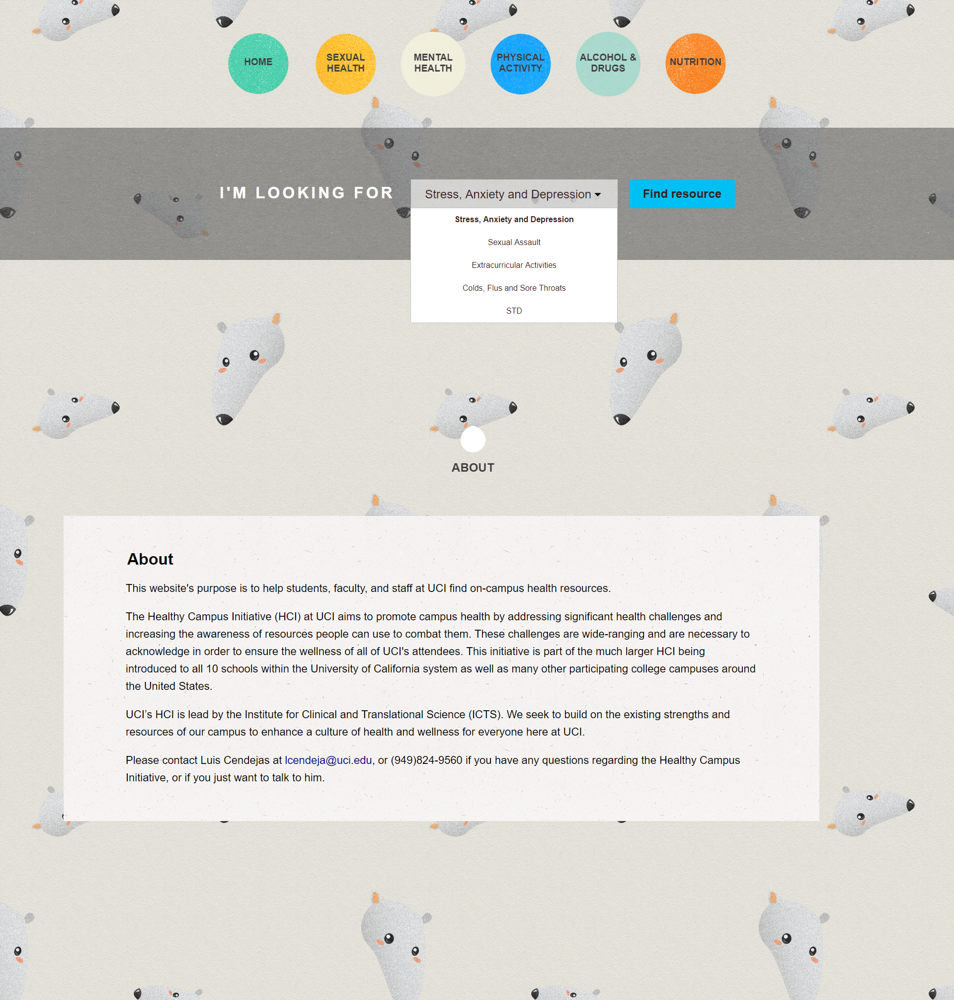

# Healthy Campus Initiative

  

A website created for University of California, Irvine that serves as hub for all the health-related resources available for both faculty and staff.

## How It Works

### Home Page:

Users can see the navigation buttons which consists of the home button and various working group page (which I will talk about later on). The main feature of this page is the dropdown search, which list a couple of popular topic (according to our group’s research) about health related topics on campus. Once the user chooses his/her desired topic, it will then lead him/her to a page that best suit their needs. For example, if a user choose a topic about Sexual Assault, the website will redirect the user to UCI’s Campus Assault Resources and Education homepage.

In addition, when scrolled down, users will see the About page which shows the website’s purpose and our supervisor’s contact information.

### Working Group Page:

All health related campus resources are categorized into five working groups.

- Physical Activity
- Alcohol and Drugs
- Mental Health
- Sexual Health
- Nutrition

[Insert sub page here]

Each page is consist of the following:

- **Description**: Gives the overview of the page
- **National Hotlines**: List useful hotlines users can utilize
- **Student Resource Links**: Links that are useful for students
- **Faculty Resource Links**: Links that are useful for faculty

_Note: There are overlapping resources, meaning that both staff and student contain both links._

### Resource Modal

[Insert Modal here]

When users press a link, a modal will pop, like the one above, that display relevant information such as contact information and location, of the resource.

## Built With

- **HTML5, CSS3, JavaScript**: Frontend Language
- **PHP**: Backend Language
- **JQuery**: Javascript Framework

## Licence

This project is licensed under the MIT License

## Bugs

None

## Future Plans

None

